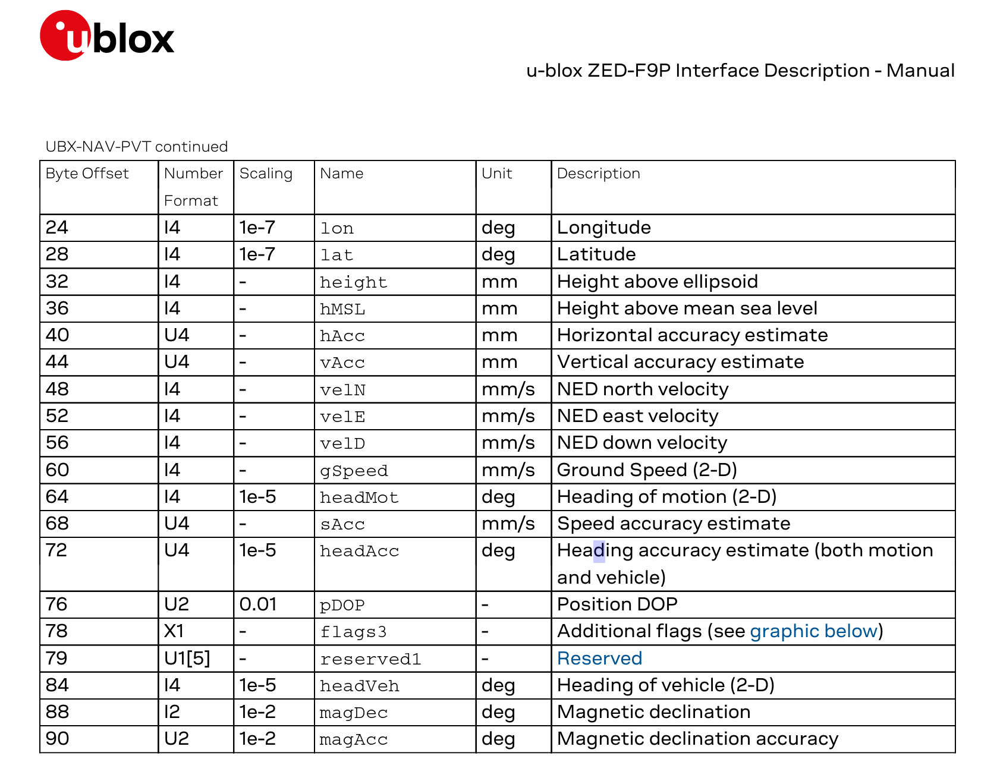

# Base for GPS ROS2 node for Codename Merckx

+ Typically, the GPS device is connected to the Jetson at `/dev/ttyACM0`.

## ROS2 Message Implementation

### Data types

[The manual](assets/u-blox-zed-f9p-interface-description.pdf) describes the data types used internally. The ROS2 message data types closely follow the ones used by U-blox.

Page 30:


Page 31:


### GPS Data Output

The ROS2 message relays most of the following data:

Page 155:


Page 156:



### Data in ROS2 msg and corresponding type/units

Actual file at: [`codename-merckx/project/gps_ws/src/ublox_gps_interface/msg`](https://github.com/borealbikes-dev/codename-merckx/blob/main/project/gps_ws/src/ublox_gps_interface/msg/UbloxGPS.msg)

Data Type | Name | Units
--- | --- | ---
uint16 | year | 
uint8 | month |
uint8 | day |
uint8 | hour |
uint8 | minutes | 
float64 |precise_seconds | seconds
float32 | time_accuracy | nanoseconds
uint8 | num_satellites | 
int32 | longitude | degrees
int32 | latitude | degrees
int32  | ellipsoid_height | millimeters
int32  | msl_height | millimeters
uint32  | horizontal_accuracy | millimeters
uint32 vertical_accuracy | millimeters
int32  | ned_north_velocity | millimeters/second
int32  | ned_east_velocity | millimeters/second
int32  | ned_down_velocity | millimeters/second
int32  | ground_speed | millimeters/second
int32  | heading_of_motion | degrees
uint32  | speed_accuracy | millimeters/second
uint16  | position_dop | None: Dilution of Precision
int32  | heading_of_vehicle | degrees
int16  | magnetic_declination | degrees
uint16  | magnetic_declination_accuracy | degrees


Qwiic_Ublox_Gps_Py
----

<p align="center">
     
      
</p>
<p align="center">
	<a href="https://pypi.org/project/sparkfun-ublox-gps/" alt="Package">
		</a>
	<a href="https://github.com/sparkfun/Qwiic_Ublox_Gps_Py/issues" alt="Issues">
		</a>
	<a href="https://qwiic-ublox-gps-py.readthedocs.io/en/latest/index.html" alt="Documentation">
		</a>
	<a href="https://twitter.com/intent/follow?screen_name=sparkfun">
        	</a>
	
</p>

<table class="table table-hover table-striped table-bordered">
  <tr align="center">
   <td><a href="https://www.sparkfun.com/products/15136"></a></td>
   <td><a href="https://www.sparkfun.com/products/15005"></a></td>
   <td><a href="https://www.sparkfun.com/products/15193"></a></td>
   <td><a href="https://www.sparkfun.com/products/15210"></a></td>
  </tr>
  <tr align="center">
    <td><a href="https://www.sparkfun.com/products/15136">SparkFun GPS-RTK2 - ZED-F9P (GPS-15136)</a></td>
    <td><a href="https://www.sparkfun.com/products/15005">SparkFun GPS-RTK - NEO-M8P-2 (GPS-15005)</a></td>
    <td><a href="https://www.sparkfun.com/products/15193">SparkFun ZOE-M8Q Breakout (GPS-15193)</a></td>
    <td><a href="https://www.sparkfun.com/products/15210">SparkFun SAM-M8Q Breakout (GPS-15210)</a></td>
  </tr>
   <td><a href="https://www.sparkfun.com/products/16344"></a></td>
   <td><a href="https://www.sparkfun.com/products/16475"></a></td>
   <td><a href="https://www.sparkfun.com/products/15733"></a></td>
  </tr>
  <tr align="center">
    <td><a href="https://www.sparkfun.com/products/16344">SparkFun GPS-RTK Dead Reckoning - ZED-F9R (GPS-16344)</a></td>
    <td><a href="https://www.sparkfun.com/products/16475">SparkFun GPS-RTK Dead Reckoning Phat- ZED-F9R (GPS-16475)</a></td>
    <td><a href="https://www.sparkfun.com/products/15733">SparkFun GPS Dead Reckoning - NEO-M9N (GPS-15733)</a></td>
</table>

This is a Python module for the SparkFun GPS products based on u-blox GPS modules.
	
This package is included in the overall [SparkFun qwiic Python Package](https://github.com/sparkfun/Qwiic_Py). While the module itself does not use I<sup>2</sup>C, it may none the less join the ranks when the Raspberry Pi has better support for clock stretching. None the less, a Qwiic connector has been included onboard so the GPS module can be used with our along side SparkFun's Qwiic products.

## Contents
* [Supported Platforms](#supported-platforms)
* [Dependencies](#dependencies)
* [Installation](#installation)
* [Documentation](#documentation)
* [Example Use](#example-use)

Supported Platforms
--------------------
The u-blox gps Python package currently supports the following platforms:
* [Raspberry Pi](https://www.sparkfun.com/search/results?term=raspberry+pi)
<!-- Platforms to be tested
* [NVidia Jetson Nano](https://www.sparkfun.com/products/15297)
* [Google Coral Development Board](https://www.sparkfun.com/products/15318)
-->


Documentation
-------------
The SparkFun u-blox gps module documentation is hosted at [ReadTheDocs](https://qwiic-ublox-gps-py.readthedocs.io/en/latest/index.html)

Installation
-------------

### PyPi Installation
This repository is hosted on PyPi as the [sparkfun-ublox_gps](https://pypi.org/project/) package. On systems that support PyPi installation via pip, this library is installed using the following commands

For all users (note: the user must have sudo privileges):
```sh
sudo pip install sparkfun-ublox-gps
```
For the current user:

```sh
sudo pip install sparkfun-ublox-gps
```

### Local Installation
To install, make sure the setuptools package is installed on the system.

Direct installation at the command line:
```sh
python setup.py install
```

To build a package for use with pip:
```sh
python setup.py sdist
 ```
A package file is built and placed in a subdirectory called dist. This package file can be installed using pip.
```sh
cd dist
pip install sparkfun_ublox_gps-<version>.tar.gz
  
```
Example Use
---------------

```python

from ublox_gps import UbloxGps
import serial
# Can also use SPI here - import spidev
# I2C is not supported

port = serial.Serial('/dev/serial0', baudrate=38400, timeout=1)
gps = UbloxGps(port)

def run():
  
  try: 
    print("Listenting for UBX Messages.")
    while True:
      try: 
        coords = gps.geo_coords()
        print(coords.lon, coords.lat)
      except (ValueError, IOError) as err:
        print(err)
  
  finally:
    port.close()

if __name__ == '__main__':
  run()
 ```

### Examples Directory
---
* geo_coords_ex1.py 
	* Simple example showing how to get and print out latitude, longitude, and
		heading. 
* gps_time_ex2.py 
	* Simple example showing how to UTC time and how to check its' validity.
* dead_reckoning_ex3.py 
	* Simple example showing how to use dead reckoning on dead reckoning modules.
		Make sure to take a look at our [hookup guide](https://learn.sparkfun.com/tutorials/sparkfun-gps-rtk-dead-reckoning-zed-f9r-hookup-guide) for a detailed explanation on
		where to attach the module and how to calibrate it. 
* stream_nmea_gps_ex4.py 
	* Simple example showing how to stream NMEA data from Ublox Modules.
* modifying_configuration_settings_ex5.py 
	* Simple example showing how change the configuration settings for the Ublox
		Module. 
* using_spi_ex6.py 
	* Simple example showing how to use SPI. 
		Module. 

### Attribution
---
This code is dependent on the work by [daylomople](https://github.com/dalymople) and the awesome parsing capabilities of [ubxtranslator](https://github.com/dalymople/ubxtranslator). 

### To Do
---
* [ ] Some bugs associated with SPI writes.
* [ ] Add more Classes and Messages to `sparkfun_predefines.py` so that a
	greater variety of messages can be parsed. 
* [ ] Fix bug when getting configuration settings. 


